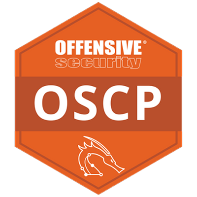
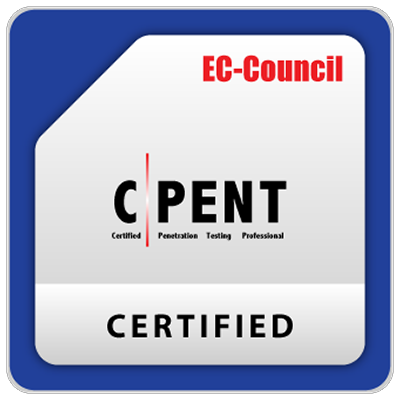
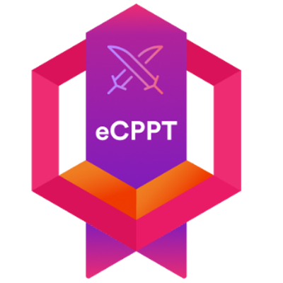
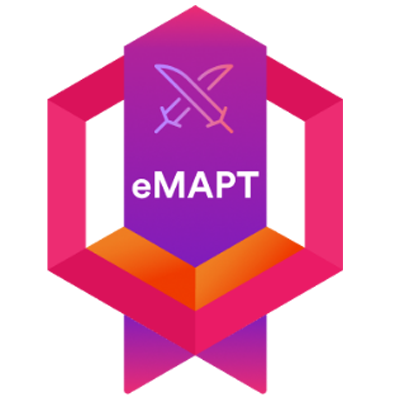
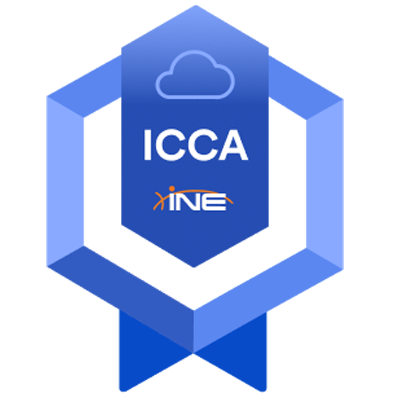
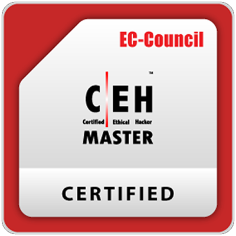
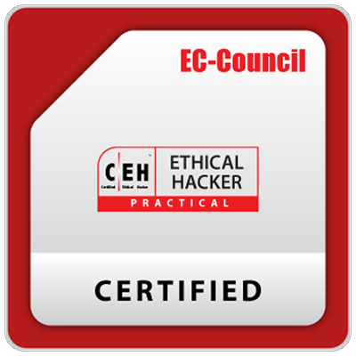
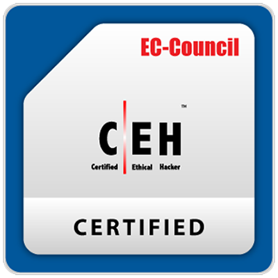
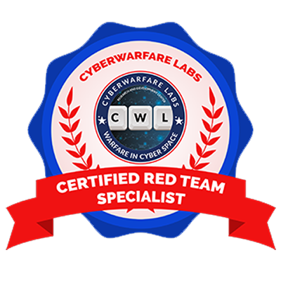

<h2> 😎🤏 Hi, I am Harith D - aka h4rithd! </h2>

### Offensive Security Engineer • 7+ Years in Cyber Security • CTF Player • Builder  
### Glad to see you here! &nbsp; 

I am an **Lead Offensive Security Engineer** with **7+ years of hands-on experience in cyber security**.
My work and interests are focused on offensive security, penetration testing, red teaming, exploit development, pivoting techniques, AV evasion, malware analysis, and practical security research. I spend a lot of time debugging, learning, playing CTFs, building labs, writing technical blog posts, and continuously sharpening my tradecraft. Beyond software security, I also enjoy working with hardware and embedded systems, including Arduino and Raspberry Pi projects. I like fresh challenges, deep technical problems, and anything that forces me to level up. 💡

<ul>
<li>🛡️ Lead Offensive Security Engineer with 7+ years of cyber security experience.</li>
<li>🎯 Focused on red teaming, penetration testing, exploit development, AV evasion, pivoting, and malware analysis.</li>
<li>👨‍🎓 Graduated from SLIIT, specializing in Cyber Security.</li>
</ul>

---

## 🌐 Reach Me

---

##  Certifications & Trophies

| OSCP | C\|PENT | eCPPT | eMAPT | ICCA | C\|EH Master |
| :---: | :---: | :---: | :---: | :---: | :---: |
|  |  |  |  |  |  |

| HTB Dante | C\|EH Practical | C\|EH | CRTS |
| :---: | :---: | :---: | :---: |
|  |  |  |  |

---

Feel free to open issues, send suggestions, or submit PRs. 🌍

